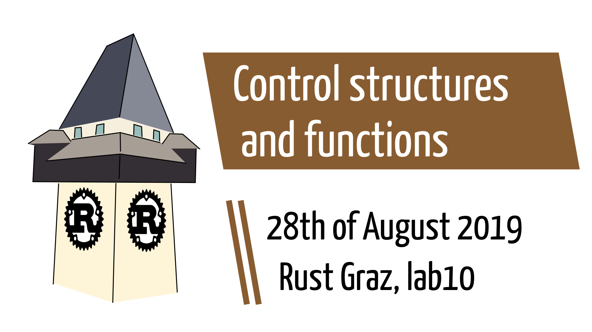
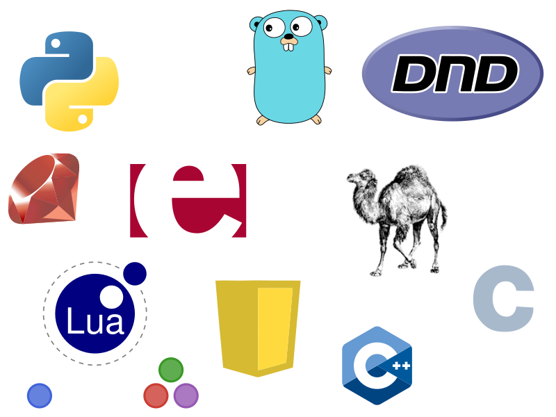
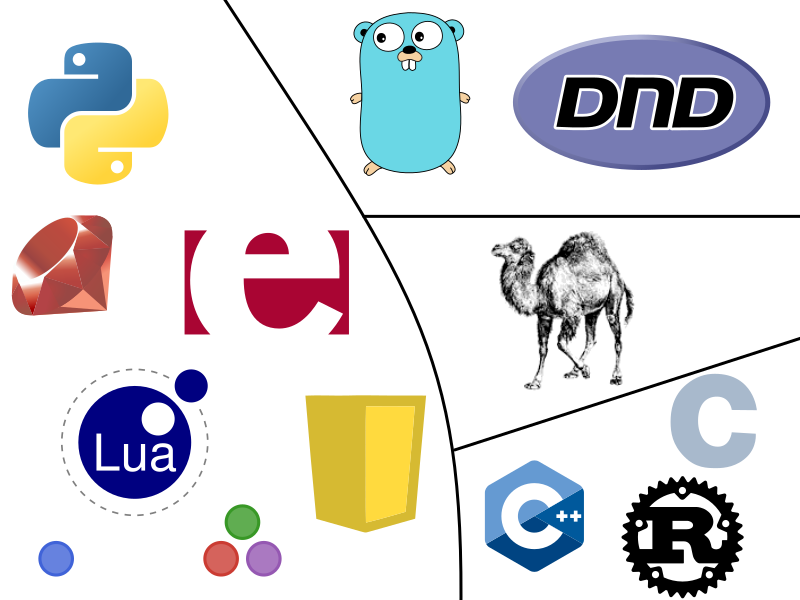

---


---

# New talk structure

* **Prologue:** Review of last talk &amp; corrections
* **Dialogue:** Main topic with discussions and examples
* **Epilogue:** Definition of next talk topic

---

# Prologue

---

## Correction 1: About RISC-V

128 bit instructions are part of the *base* instruction set.
256 bit instructions occur as part of the Advanced Vector Extensions.

---

## Clarification 2: Integer overflow in release mode

```rust
fn main() {
    let mut over = 255u8;
    over += 1;
    println!("{}", over);
}
```

```
root@unix ~ # rustc test.rs && ./test
thread 'main' panicked at 'attempt to add with overflow', test.rs:3:5
note: run with `RUST_BACKTRACE=1` environment variable to display a backtrace.
```

---

## Integer overflow in release mode

```rust
fn main() {
    let mut over = 255u8;
    over += 1;
    println!("{}", over);
}
```

```
root@unix ~ # rustc -O test.rs && ./test
0
```

⇒ In release mode, integer overflows are not runtime errors.

---

## Clarification 3: Denormal numbers

Advanced IEEE 754 topic, I skipped last time.

Denormal numbers ensure: `x = y ⇔ x - y = 0`.

---

## Denormal numbers

IEEE 754 defines the concept of [Denormal numbers](https://en.wikipedia.org/wiki/Denormal_number).

> In computer science, __denormal__ numbers or __denormalized__ numbers (now often called __subnormal__ numbers) fill the underflow gap around zero in floating-point arithmetic. Any non-zero number with magnitude smaller than the smallest normal number is "subnormal".

---

## Clarification 4: <br/> f32::NAN as u32

Result of last talk: `f32::NAN as u32` gives `0`. <br/>
Intentionally?

---

### f32::NAN as u32

[test/run-pass/numbers-arithmetic/float-int-invalid-const-cast.rs#L21](https://github.com/rust-lang/rust/blob/master/src/test/run-pass/numbers-arithmetic/float-int-invalid-const-cast.rs#L21)

```rust
use std::{f32, f64};

// Forces evaluation of constants, triggering hard error
fn force<T>(_: T) {}

fn main() {
    // …
    { const X: u32 = f32::INFINITY as u32; force(X); }
    // …
}
```

---

### IEEE 754-1985

> The invalid operation exception is signaled if an operand is invalid for the operation on to be performed. The result, when the exception occurs without a trap, shall be a quiet NaN (6.2) provided the destination has a floating-point format. The invalid operations are …

---

### IEEE 754-1985

[Section 7.1 “Invalid Operation”](http://www.cs.nthu.edu.tw/~ychung/slides/CSC3050/IEEE-754-1985.pdf)

<blockquote style="font-size:80%"><ol>
<li>Any operation on a signaling NaN (6.2)</li>
<li>Addition or subtraction—magnitude subtraction of infinites such as, (+∞) + (−∞)</li>
<li>Multiplication—0 × ∞</li>
<li>Division—0/0 or ∞/∞</li>
<li>Remainder— x REM y, where y is zero or x is infinite</li>
<li>Square root if the operand is less than zero</li>
</ol></blockquote>

---

### IEEE 754-1985

> 7. **Conversion** of a binary floating-point number to an integer or decimal format when overflow, infinity, or **NaN** precludes a faithful representation in that format and this cannot otherwise be signaled
> 8. Comparison by way of predicates involving &lt; or &gt;, without ?, when the operands are unordered (5.7, Table 4)

---

### Game: Guess the language

Guess the programming language by the following modified logos.

<div style="font-size:70%" class="fragment">

__Legal:__

* Gopher by Takuya Ueda (CC 3.0 BY).
* Javascript Badge by Nikotaf (CC BY-SA 4.0 Intl.).
* Removing “Lua” from the Lua logo would constitute [copyright infringement](https://www.lua.org/images/).
* Original PHP logo by Colin Viebrock under CC BY-SA 4.0 Intl.
* The ruby logo was designed by Yukihiro Matsumoto under CC BY-SA 2.5.
* ISO/C++ → mod. requires permission → no reply after 1 month

</div>

---



---

### f32::NAN as u32

4 categories of behavior:

1. panic / exception / error
2. -9223372036854775808
3. NaN
4. 0

Which languages show which behavior?

---

### f32::NAN as u32

<table style="vertical-align: top">
<tr><th>panic / exception / error</th><td>⇒</td><td>Python, Ruby, Erlang, Lua, JavaScript (w.r.t. `BigInt`), Julia</td></tr>
<tr><th>-9223372036854775808</th><td>⇒</td><td>Go, PHP</td></tr>
<tr><th>NaN</th><td>⇒</td><td>Perl</td></tr>
<tr><th>0</th><td>⇒</td><td>C, C++, _rust_</td></tr>
</table>

---



L: panic, TR: -9223372036854775808, MR: NaN, BR: 0

---

### Perl's special behavior

```perl
#!/usr/bin/perl -l

my $value = 1.2;
print $value;
print int($value);

my $nan = "NaN" + 1;
#my $nan = -sin(9**9**9);
print $nan;
print int($nan);
```

---

### Perl's special behavior

```
1.2
1
NaN
NaN
```

---

### Perl's special behavior

Deep dive into perl internals:

```perl
use Devel::Peek;

$nan = "NaN" + 1;
$forced_nan = int($nan);

# SV = scalar value, UV = unsigned integer value, NV = double
Dump $nan;
Dump $forced_nan;
```

---

### Perl's special behavior

```
SV = PVNV(0x55a203d161b0) at 0x55a203db5970
  REFCNT = 1
  FLAGS = (NOK,pIOK,pNOK,IsUV)
  UV = 0
  NV = NaN
  PV = 0
SV = NV(0x55a203d64300) at 0x55a203d64318
  REFCNT = 1
  FLAGS = (NOK,pNOK)
  NV = NaN
```

`NV` = double value NaN ⇒ `int()` enforces integer representation but does not change value?!

---

# Dialogue

---

## Control structures

```C
#include <stdio.h>
int main() {
	int i;
	for (i = 0; i < 10; i++) {
		printf("%d\n", i);
	} while (i < 42);
}
```

---

### Branching

---

#### if conditions

```rust
fn main() {
    let age = 28;
    if age > 25 {
        println!("I am old!");
    } else {
        println!("Still a youngster!");
    }
}
```

<!-- Based on http://rosettacode.org/wiki/Filter with additional research --> 

**Syntactical remarks:**

<table style="font-size:70%">
<tr><th>C-based</th><td>⇒</td><td>`if ( cond ) { then }`</td></tr>
<tr><th>TCL</th><td>⇒</td><td>`if { cond } { then }`</td></tr>
<tr><th>Dyalect, Go, rust</th><td>⇒</td><td>`if cond { then }`</td></tr>
<tr><th>Batch File</th><td>⇒</td><td>`if cond ( then )`</td></tr>
</table>

---

#### if conditions

```rust
fn main() {
    let age = 28;
    println!("I am {}!",
        if age > 25 { "old" } else { "young" }
    );
}
```

---

#### if conditions

⇒ no ternary operator `cond ? then : else`

```C
#include <stdio.h>
  
int main() {
    int age = 28;
    printf("I am %s\n", age <= 20 ? "young" : "old");
    return 0;
}
```

**Bonus question:** Do ruby or python have a ternary operator?

---

#### if conditions

**Quiz:** What will the output show?

```C
#include <stdio.h>

int main() {
    int age = 28;
    printf("I am in my %ds\n",
        age <= 20 ? 10 : age > 30 ? 30 : 20
    );
    return 0;
}
```

---

#### if conditions

**Quiz:** What will the output show?

```php
<?php
$age = 28;
echo "I am in my "
    . (age <= 20 ? 10 : age > 30 ? 30 : 20)
    . "s\n";
```

<table>
<tr><th>C</th><td>⇒</td><td>20s, left-associative evaluation</td></tr>
<tr><th>PHP</th><td>⇒</td><td>30s, right-associative evaluation</td></tr>
</table>

---

#### if conditions

Back to rust.

[RFC 1362 “Rust Needs The Ternary Conditional Operator (-?-:-)” [Closed]](https://github.com/rust-lang/rfcs/issues/1362)

[via dscorbett, 2015/11/10](https://github.com/rust-lang/rfcs/issues/1362#issuecomment-155552857)

> Rust already has this: <code style="white-space:pre-wrap">return if value == 5 { success } else { failure }</code>.

---

#### if conditions

[via tolkanabroski, 2017/05/09](https://github.com/rust-lang/rfcs/issues/1362#issuecomment-300210237)

> 5 minutes into rust first thing that i look up was Ternary operator. Im back to C. RIP.

---

#### match-case

via [The Rust Book](https://doc.rust-lang.org/rust-by-example/flow_control/match.html)

```rust
let number = 19;
match number {
    // Match a single value
    1 => println!("One!"),
    // Match several values
    2 | 3 | 5 | 7 | 11 => println!("This is a prime"),
    // Match an inclusive range [13, 19]
    13...19 => println!("A teen"),
    // Handle the rest of cases
    _ => println!("Ain't special"),
}
```

⇒ fancy pattern matching can be done, we will discuss it with the type system / traits.

---

#### match-case

```
warning: `...` range patterns are deprecated
 --> test.rs:9:7
  |
9 |     13...19 => println!("A teen"),
  |       ^^^ help: use `..=` for an inclusive range
  |
  = note: `#[warn(ellipsis_inclusive_range_patterns)]` on by default
```

`13...19` ⇔ [13, 19] … deprecated <br/>
`13..=19` ⇔ [13, 19] … inclusive range <br/>
`13..19` ⇔ [13, 19) … exclusive range

⇒ [RFC 37854](https://github.com/rust-lang/rust/issues/37854)

---

#### match-case

Works with strings too (to be discussed).

```rust
// What's your name?
let name = "Lukas";
match name {
    "Lukas" => println!("Access granted!"),
    _ => println!("How bad …")
}
```

---

#### match-case

All branches must have the same datatype.

```rust
fn main() {
	let eggs_required = 4;
	println!("We need {} eggs",
		match eggs_required {
			0 => "no",
			1 => 1,
			_ => "more"
		}
	);
}
```

---

#### match-case

```
error[E0308]: match arms have incompatible types
 --> test.rs:6:9
  |
4 |           match eggs_required {
  |  _________-
5 | |             0 => "no",
  | |                  ---- this is found to be
  | |                     of type `&'static str`
6 | |             1 => 1,
  | |                  ^ expected &str, found integer
7 | |             _ => "more"
8 | |         }
  | |_________- `match` arms have incompatible types
  |
  = note: expected type `&str`
             found type `{integer}`

error: aborting due to previous error

For more information about this error, try `rustc --explain E0308`.
```

---

#### match-case

```rust
fn main() {
    let eggs_required = 4;
    println!("We need {} eggs",
        match eggs_required {
            0 => "no",
            0 => "one",
            _ => "more"
        }
    );
}
```

```
warning: unreachable pattern
 --> test.rs:6:4
  |
6 |             0 => "one",
  |             ^
  |
  = note: `#[warn(unreachable_patterns)]` on by default

We need more eggs
```

---

#### match-case

You need to cover __all__ branches!

```
error[E0004]: non-exhaustive patterns: `-2147483648i32..=0i32`,
              `4i32`, `6i32` and 3 more not covered
 --> test.rs:3:7
  |
3 | match number {
  |       ^^^^^^ patterns `-2147483648i32..=0i32`, `4i32`,
  |                       `6i32` and 3 more not covered
  |
  = help: ensure that all possible cases are being handled,
          possibly by adding wildcards or more match arms

error: aborting due to previous error

For more information about this error, try `rustc --explain E0004`.
```

---

#### match-case

… which the compiler does not always recognize.

```rust
let num = 5;
println!("The number is {}!",
    match num % 2 {
        1 => "odd",
        0 => "even",
    }
);
```

⇒ error[E0004]: non-exhaustive patterns: `-2147483648i32..=-1i32` and `2i32..=2147483647i32` not covered

---

#### expressions

__Conclusio:__ rust is _expression_-oriented.

* C and many other languages distinguish between statements (e.g. `int a = 5;`) and expressions (e.g. `5`).
* Functional languages commonly only define expressions.

Thus, the following is a valid program:

```rust
fn main() {
    5;
}
```

---

#### expressions

Wait! What about the following program?

```rust
fn main() {
    let whoami = println!("Hello World!");
    println!("{}", whoami);
}
```

---

#### expressions

```
error[E0277]: `()` doesn't implement `std::fmt::Display`
 --> test.rs:3:20
  |
3 |     println!("{}", whoami);
  |                    ^^^^^^ `()` cannot be formatted
  |                           with the default formatter
  |
  = help: the trait `std::fmt::Display` is not
          implemented for `()`
  = note: in format strings you may be able to
          use `{:?}` (or {:#?} for pretty-print) instead
  = note: required by `std::fmt::Display::fmt`

error: aborting due to previous error

For more information about this error, try `rustc --explain E0277`.
```

---

#### expressions

* There are expressions that return “nothing”
* We just discovered the datatype `unit`
* `unit` is represented as `()`
* `num += 1` also returns `()`

---

### Loops

---

#### for loop

```rust
fn main() {
    for i in 1..35 {
        if i % 3 == 0 && i % 5 == 0 {
            println!("Fizz Buzz")
        } else if i % 5 == 0 {
            println!("Buzz")
        } else if i % 3 == 0 {
            println!("Fizz")
        } else {
            println!("{}", i)
        }
    }
}
```

1 2 Fizz 4 Buzz Fizz 7 8 Fizz Buzz 11 Fizz
13 14 Fizz Buzz 16 17 Fizz 19 Buzz Fizz 22
23 Fizz Buzz 26 Fizz 28 29 Fizz Buzz 31 32 Fizz 34

---

#### for loop

**Syntactical remarks:**

via Pascal:

```pascal
type
  digit = 0..9;
  letter = 'A'..'Z';
var
  num: digit;
  alpha: letter;
```

---

#### for loop

```rust
fn main() {
    for i in 1..5 {
        println!("Hello?");
    }
}
```

```
warning: unused variable: `i`
 --> test.rs:2:9
  |
2 |     for i in 1..5 {
  |         ^ help: consider prefixing with
  |                 an underscore: `_i`
  |
  = note: `#[warn(unused_variables)]` on by default

Hello?
Hello?
Hello?
Hello?
```

---

#### unused variables

* Sometimes we need to assign a name to some value, which we won't use
* Use `_` if you want to ignore the value
* In rust, `_` is a reserved identifier

This idiom exists in many languages.
What about Clojure, Python, C#, Javascript and Go?

<!--
	Clojure: normal identifier, only used as “ignored value”
	Python: convention established by pylint, in shells means "text of previous line", as prefix private members
	C#: conventionally, as prefix private members
	Javascript: normal identifier, see underscore.js
	Go: can be assigned not read, like rust
-->

```rust
fn main() {
    for _ in 1..5 {
        println!("Hello?");
    }
}
```

---

#### for loop

**Question:** What is the expression value of a loop?

---

#### for loop

```rust
fn main() {
    let hello = "hello";
    let expr_value = for i in 1..=5 {
        println!("{}", &hello[0..i]);
    };
    println!("{}", expr_value);
}
```

```
error[E0277]: `()` doesn't implement `std::fmt::Display`
 --> test.rs:6:20
  |
6 |     println!("{}", expr_value);
  |                    ^^^^^^^^^^ `()` cannot be
  |         formatted with the default formatter
…
```

---

#### while loop

**Question:** When do we use for loops? <br/> when do we use while loops?

via [The Rust Book](https://doc.rust-lang.org/1.1.0/book/while-loops.html)

```rust
let mut x = 5;
let mut done = false;

while !done {
    x += x - 3;

    println!("{}", x);

    if x % 5 == 0 {
        done = true;
    }
}
```

---

#### infinite loop

```rust
loop {
	let message = read_from_some(socket);
	match message.command {
		"STOP" => break,
		"IGNORE" => continue,
		"PRINT" => println!("received: {}\n", message),
	};
}
```

* `break` terminates any loop immediately
* `continue` skips the remaining loop body

---

## Bonus: control structures in action

```rust
fn main() {
	let squares = vec![1, 2, 4, 9];

	for (i, square) in squares.iter().enumerate() {
		println!("{} ⇒ {}  ", i, square);
	}

	println!("");

	let skip_iter = squares.iter().skip(1);
	for (prev, next) in squares.iter().zip(skip_iter) {
		println!("diff = {}", next - prev);
	}
}
```

---

## Bonus: control structures in action

```
0 ⇒ 1  
1 ⇒ 2  
2 ⇒ 4  
3 ⇒ 9  

diff = 1
diff = 2
diff = 5
```

---

## Bonus: control structures in action

```rust
use std::collections::HashMap;

fn main() {
	let text = "Hello World";

	let mut freq: HashMap<u8, u8> = HashMap::new();
	for chr in text.bytes() {
		*freq.entry(chr).or_insert(0) += 1
	}

	for (c, f) in freq.iter() {
		println!("{} (ASCII {:>3}) ⇒ {:>2}",
			(*c as char), c, f);
	}
}
```

---

## Bonus: control structures in action

```
'l' (ASCII 108) ⇒  3  
'W' (ASCII  87) ⇒  1  
' ' (ASCII  32) ⇒  1  
'd' (ASCII 100) ⇒  1  
'e' (ASCII 101) ⇒  1  
'r' (ASCII 114) ⇒  1  
'H' (ASCII  72) ⇒  1  
'o' (ASCII 111) ⇒  2
```

---

## Functions

---

### Named functions

* We already know one function: `main`
* We can define custom functions

```rust
fn add(a: u32, b: u32) -> u32 {
	return a + b;
}

fn main() {
	println!("23 + 19 = {}", add(23, 19));
}
```

```
23 + 19 = 42
```

---

### Named functions

* The last expression is the return value
* Pay attention to any semicolon

```rust
fn add(a: u32, b: u32) -> u32 {
	a + b
}

fn main() {
	println!("23 + 19 = {}", add(23, 19));
}
```

---

### Named functions

```rust
fn add(a: u32, b: u32) -> u32 {
	a + b;
}

fn main() {
	println!("23 + 19 = {}", add(23, 19));
}
```

---

### Named functions

```
error[E0308]: mismatched types
 --> test.rs:1:27
  |
1 | fn add(a: u32, b: u32) -> u32 {
  |    ---                    ^^^ expected u32, found ()
  |    |
  |    this function's body doesn't return
2 |     a + b;
  |          - help: consider removing this semicolon
  |
  = note: expected type `u32`
             found type `()`

error: aborting due to previous error

For more information about this error, try `rustc --explain E0308`.
```

---

### Named functions

```rust
fn main() {
    println!("23 + 19 = {}",
        (fn add(a: u32, b: u32) -> u32 { a + b })
        (23, 19)
    );
}
```

**Guess:** Does this work?

---

### Named functions

```
error: expected expression, found keyword `fn`
 --> test.rs:3:10
  |
3 |         (fn add(a: u32, b: u32) -> u32 { a + b })
  |          ^^ expected expression

error: aborting due to previous error
```

---

### Named functions

```rust
fn main() {
    fn add(a: u32, b: u32) -> u32 {
        a + b
    }
    println!("23 + 19 = {}", add(23, 19));
}
```

**Guess:** Does this work? <span class="fragment">Yes.</span>

---

### Anonymous functions

* Anonymous functions in general have no name
* Reduces the synactic overhead of named functions
* Commonly used only used once for `map` or alike

```rust
fn main() {
    let vals = vec![0, 0, 1, 2, 4, 7];
    for digit in vals.iter().map(|item| { item + 1 }) {
        println!("{}", digit);
    }
}
```

---

### Anonymous functions

* Functions can be assigned …
* … multiple times

```rust
fn main() {
    let i_am_a_function = |a: u32, b: u32| {
        a + b
    };
    let add = i_am_a_function;

    println!("23 + 19 = {}", add(23, 19));
}
```

---

### Anonymous functions

In an anonymous manner, our guess-example from before works.

```rust
fn main() {
    println!("23 + 19 = {}",
        (|a: u32, b: u32| { a + b })
        (23, 19)
    );
}
```

---

### Anonymous functions

**Syntactical remarks - claim:** <br/>
ruby introduced this syntax

```
irb(main):001:0> my_array = [1, 3, 4, 6];
=> [1, 3, 4, 6]
irb(main):002:0> my_array.each{ |item| puts item }
1
3
4
6
=> [1, 3, 4, 6]
irb(main):003:0> 
```

---

### Anonymous functions

<table>
<tr><th>Ruby:</th><td>`|a, b| { a + b }`</td></tr>
<tr><th>Python:</th><td>`lambda a, b: a + b`</td></tr>
<tr><th>Clojure:</th><td>`#(+ %1 %2)`</td></tr>
<tr><th>Groovy:</th><td>`{ int a, int b -> a + b }`</td></tr>
<tr><th>Haskell:</th><td>`(\x y -> x + y)`</td></tr>
<tr><th>C++11:</th><td>`[](int a, int b) { return a + b; }`</td></tr>
</table>

---

### Closures

A function accesses values outside the scope it constitutes.

```rust
fn main() {
    let c = 1;
    let add = |a: u32, b: u32| { a + b + c };
    println!("23 + 18 + 1 = {}", add(23, 18));
}
```

```
23 + 18 + 1 = 42
```

---

### Closures

```rust
fn main() {
    let mut c = 1;
    let add = |a: u32, b: u32| { a + b + c };
    println!("23 + 18 + 1 = {}", add(23, 18));
}
```

⇒ warning: variable does not need to be mutable

```
23 + 18 + 1 = 42
```

---

### Closures

```rust
fn main() {
    let mut c = 1;
    let add = |a: u32, b: u32| { c += 1; a + b + c };
    println!("23 + 18 + 1 = {}", add(23, 18));
}
```

```
error[E0596]: cannot borrow `add` as mutable,
              as it is not declared as mutable
 --> test2.rs:4:34
  |
3 | let add = |a: u32, b: u32| { c += 1; a + b + c };
  |     --- help: consider changing this to be mutable: `mut add`
4 | println!("23 + 18 + 1 = {}", add(23, 18));
  |                              ^^^ cannot borrow as mutable

error: aborting due to previous error

For more information about this error, try `rustc --explain E0596`.
```

---

### Closures

Compiler messages are often very helpful.
So, let's just do it. `add` is now mutable:

```rust
fn main() {
    let mut c = 1;
    let mut add = |a: u32, b: u32| { c += 1; a + b + c };
    println!("23 + 18 + 1 = {}", add(23, 18));
}
```

```
23 + 18 + 1 = 43
```

---

### Blocks `{}` define scopes

```rust
fn add(a: u32, b: u32) {
    let c = 1;
    a + b
}

fn main() {
    println!("23 + 18 + 1 = {}", add(23, 18 + c));
}
```

```
error[E0425]: cannot find value `c` in this scope
 --> test2.rs:7:47
  |
7 |     println!("23 + 18 + 1 = {}", add(23, 18 + c));
  |                       not found in this scope ^

…
```

---

### Blocks {} define scopes

```rust
fn main() {
    {
        let b = 6;
    }
    println!("{}", b);
}
```

```
error[E0425]: cannot find value `b` in this scope
 --> test.rs:5:20
  |
6 |     println!("{}", b);
  |                    ^ help: a local variable with a
  |                      similar name exists: `a`

error: aborting due to previous error

For more information about this error, try `rustc --explain E0425`.
```

---

### Functions: to be continued

Advanced topics:

* Functions are types implementing traits
* Borrowing
* Methods and traits
* Visibility of functions and modules
* Functions and control structures in LLVM IR

---

# Epilogue

---

## Quiz

<dl>
<dt>Which three loop constructs do we have in rust?</dt>
<dd class="fragment"><code>for</code>, <code>loop</code>, <code>while</code></dd>
<dt>Which identifier is used for unused variables?</dt>
<dd class="fragment"><code>_</code></dd>
<dt>What is an anonymous function?</dt>
<dd class="fragment">Function without a name</dd>
<dt>What is a closure?</dt>
<dd class="fragment">Function accessing values from outside scope(s)</dd>
<dt>What constitutes a scope in rust?</dt>
<dd class="fragment"><code>{ }</code></dd>
</dl>

---

## Next session

Wed, 2019/09/25 19:00

Show of hands:

* **Topic 1:** Strings, string types and UTF-8
* **Topic 2:** References, borrowing & borrow checker

⇒ majority voted in favor of topic 2.

<!-- 

TODO show how C switch statements turn into hash maps in assembly
TODO show how match case is compiled in rust

for (byte1, byte2) in src.iter().step_by(2).zip(src.iter().skip(1).step_by(2)) {

print!("{} ⇒ {1:<2$b}  ", *c as char, hchar.bits & bitmask, 11);


    for i in [1, 0].iter() {
        println!("Hello, world! {}", i);
    }

    for i in [1, 0].iter().rev() {
        println!("Hello, world! {}", i);
    }

TODO implement iterator and see that lt/gt/le/ge is required

TODO rust does not satisfy referential transparency: sometimes assignment makes the program compile
-->
